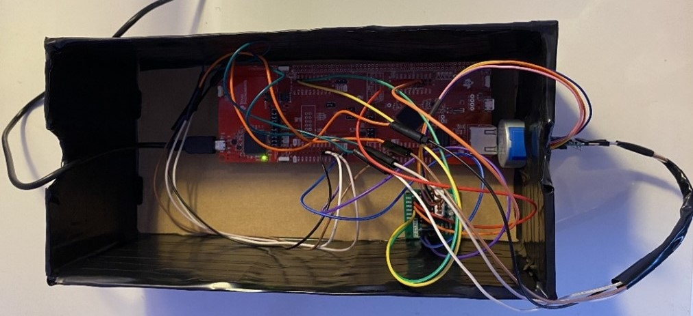
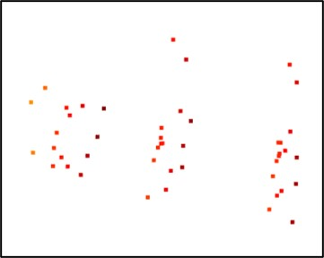
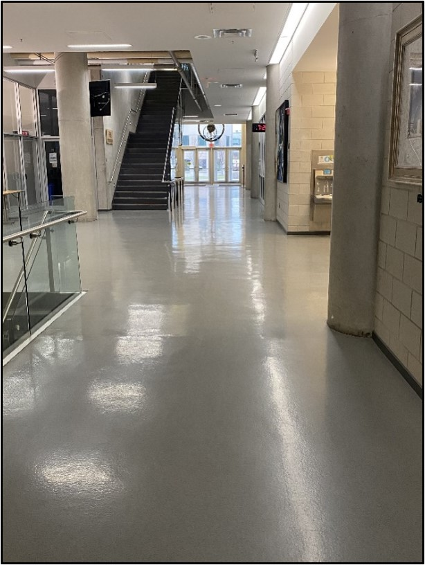

# Spatial 360 Mapping

McMaster ENGINEER 2DX4, Jan 2023 – Apr 2023.

Embedded scanning system that rotates a Time of Flight sensor through a full 360 degree sweep and reconstructs the readings into a 3D point cloud and mesh of an indoor space.

`C/C++` `Keil uVision` `I2C/UART` `Python` `TI MSP432E401Y Microcontroller` `VL53L1X ToF Sensor` `MOT-28BYJ-48 Stepper Motor` `ULN2003 Driver Board` `Open3D`

<p align="center">
<br>
<em>Circuit built with the MSP432E401Y microcontroller, VL53L1X ToF sensor, and MOT-28BYJ-48 stepper motor mounted for scanning.</em>
</p>

---

## Table of Contents
- [Overview](#overview)
- [Hardware & Software](#hardware--software)
- [System Architecture](#system-architecture)
- [How It Works](#how-it-works)
  - [1. Distance Measurement](#1-distance-measurement)
  - [2. Rotation & Sweep Control](#2-rotation--sweep-control)
  - [3. Data Communication](#3-data-communication)
  - [4. Coordinate Conversion & Visualization](#4-coordinate-conversion--visualization)
- [Running the System](#running-the-system)
- [Application Example](#application-example)
- [Results](#results)
- [Limitations](#limitations)
- [Full Report](#full-report)

---

## Overview

This project addresses the need for an accessible, low cost way to capture spatial distance data of an indoor environment and reconstruct it into a usable 3D digital representation, without relying on expensive lidar equipment. A VL53L1X Time of Flight sensor is rotated through a full 360 degree sweep by a MOT-28BYJ-48 stepper motor, taking a distance reading every 22.5 degrees (16 measurements per rotation). Each reading is sent from a TI MSP432E401Y microcontroller to a PC over UART, converted into xyz coordinates in Python, and rendered as a 3D point cloud and connected mesh using the Open3D library. The system was used to scan a hallway in McMaster's Engineering Technology Building.

---

## Hardware & Software

### Hardware

| Component | Purpose |
|---|---|
| TI MSP432E401Y Microcontroller | ARM Cortex-M4F core that drives the sensor, stepper motor, pushbutton, and LEDs, and relays data to the PC |
| VL53L1X Time of Flight Sensor | Emits a 940nm laser pulse and measures its return time to determine distance to the nearest surface, up to 4000mm |
| MOT-28BYJ-48 Stepper Motor | Rotates the sensor in fixed 22.5 degree increments, 512 steps per full rotation |
| ULN2003 Driver Board | Drives the MOT-28BYJ-48 stepper motor from the microcontroller's digital outputs |
| Onboard Pushbutton (PJ1) | Starts and stops each scan, configured with interrupts |
| Onboard LEDs (PF4, PF0) | Flashes on each measurement for real time scan status indication |
| Box | Encloses and positions the circuit for scanning |

### Software

| Tool / Library | Purpose |
|---|---|
| Keil uVision (2dx_studio_8c.c) | Embedded C firmware for sensor, motor, pushbutton, and LED control on the microcontroller |
| Python 3.9 (2dX3_FinalProject.py) | Reads incoming UART data and converts distance/angle readings into xyz coordinates |
| Python 3.9 (O3D_FinalProject.py) | Reads the resulting .xyz file and generates the point cloud and 3D mesh |
| math | Provides trigonometric functions used in the xyz coordinate conversion |
| serial | Handles UART communication with the microcontroller over the COM port |
| numpy | Handles array operations on the collected coordinate data |
| Open3D | 3D data processing and visualization, and renders the point cloud and connected mesh |

---

## System Architecture

| Stage | Hardware | Output |
|---|---|---|
| Distance Measurement | VL53L1X ToF sensor -> MSP432E401Y microcontroller (I2C) | Raw distance reading per angular step |
| Rotation | MSP432E401Y microcontroller -> ULN2003 driver board -> MOT-28BYJ-48 stepper motor | Sensor rotated 22.5 degrees per step, 16 steps per full sweep |
| Data Transfer | MSP432E401Y microcontroller -> PC (UART, 115200 baud) | Distance and step count streamed to Python |
| Coordinate Conversion | PC (2dX3_FinalProject.py) | `.xyz` coordinate file |
| Visualization | PC (O3D_FinalProject.py, Open3D) | Rendered point cloud and connected 3D mesh |

<p>I2C connections: SDA to PB3, SCL to PB2.</p>
<p>Stepper motor connections: IN1–IN4 to PH0–PH3.</p>

---

## How It Works

### 1. Distance Measurement

- The VL53L1X sensor emits a 940nm invisible laser pulse that reflects off the nearest surface, and measures the travel time of that pulse to compute distance.
- Distance is calculated as travel time divided by two, multiplied by the speed of light, giving readings in millimetres.
- The sensor communicates with the microcontroller over I2C, with SDA wired to PB3 and SCL wired to PB2.
- A measurement is taken every 22.5 degrees of rotation, for 16 total measurements per full 360 degree sweep.

### 2. Rotation & Sweep Control

- The MOT-28BYJ-48 stepper motor, driven through a ULN2003 driver board, rotates the sensor in fixed 22.5 degree increments (512 steps per full rotation).
- An onboard pushbutton (PJ1), configured with interrupts, starts and stops each scan.
- Onboard LEDs (PF4, PF0) flash during each measurement, providing real time status feedback as the rotation progresses.
- Once a full rotation completes, the system pauses so the user can manually displace the entire setup along the x-axis before starting the next scan, allowing multiple slices to be captured along a hallway or other space.

### 3. Data Communication

- Completed distance and angle data are sent from the microcontroller to the PC over UART at a baud rate of 115200.
- The serial port is opened in Python, cleared of leftover data, and read continuously as each measurement arrives.
- Data collection begins after the microcontroller is reset and the onboard pushbutton is pressed, and continues until the number of scans entered by the user has been completed.

### 4. Coordinate Conversion & Visualization

- `2dX3_FinalProject.py` converts each distance and stepper angle reading into xyz coordinates using the following, where r is the measured distance:
  - Angle = (Number of Steps / 512) × 2π
  - Y = r × sin(angle)
  - Z = r × cos(angle)
  - X = displacement value, incremented after each full rotation
- Converted coordinates are written to a `.xyz` file as each scan completes.
- `O3D_FinalProject.py` reads the `.xyz` file with `o3d.io.read_point_cloud` and renders the point cloud and connected mesh with `o3d.visualization.draw_geometries`.
- Both the point cloud and the final 3D visualization can be rotated and manipulated by clicking and dragging within the Open3D window.

<p align="center">
  
  
</p>
<p align="center"><em>Point cloud and connected 3D mesh generated from a scan of a small cup.</em></p>

---

## Running the System

1. Build and load `2dx_studio_8c.c` onto the MSP432E401Y microcontroller in Keil uVision, then press the onboard reset button.
2. Run `2dX3_FinalProject.py` on the PC, confirm the COM port matches the microcontroller's UART connection, and enter the number of scans to take when prompted.
3. Position the sensor at the desired scanning location and press the onboard pushbutton (PJ1) to begin the first sweep.
4. After each full rotation, displace the setup along the x-axis and press PJ1 again to start the next scan, repeating for the number of scans entered.
5. Once scanning is complete, run `O3D_FinalProject.py` and enter the same number of scans to generate the point cloud, followed by the connected 3D mesh.

```bash
python 2dX3_FinalProject.py   # collect and convert scan data to xyz coordinates
python O3D_FinalProject.py    # render the point cloud and 3D mesh from the xyz file
```

---

## Application Example

A hallway in section F of McMaster's Engineering Technology Building was scanned using the process above, producing a 3D visual representation of the hallway's walls and surrounding structure from the connected point cloud data.

<p align="center">
  
  
</p>
<p align="center"><em>Scanned hallway (left) and its resulting 3D visual representation (right).</em></p>

---

## Results

- The system performed end to end operation successfully, from triggering a scan to capturing, transmitting, and rendering the distance data as a 3D visualization.
- A full point cloud and mesh representation of the scanned hallway was generated, confirming the sensor, motor, and processing pipeline worked together accurately across multiple scans.
- The xyz conversion pipeline was validated through manual calculation checks against the Python output and matched the expected coordinates.

---

## Limitations

- The microcontroller's floating point unit supports 32 bit precision, but trigonometric calculations for the xyz conversion were offloaded to Python for simplicity rather than computed onboard.
- The assigned bus speed of 16MHz, well below the stepper motor's 100Hz operating speed and the sensor's 400kHz interface speed, was the primary bottleneck on overall system speed.
- UART communication was capped at the standard 115200 baud rate supported by the XDS110 debug interface.
- Displacement between scans was done manually, requiring the user to physically move the setup along the x-axis between rotations.

---

## Full Report

[Read the full project report](Files/Spatial_360_Mapping_Report.pdf)
